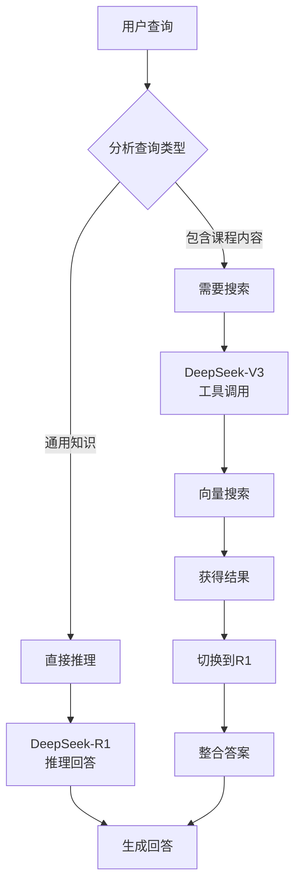

# HTML演示改进综合计划文档

## 📌 文档说明
本文档记录了RAG系统HTML演示的完整设计和改进过程，包含初始设计思路、深度改进计划和决策过程。

---

## Part 1: 初始设计思路

### 1. **页面结构设计**
- **单页面应用**：所有功能集成在一个HTML文件中，无需外部依赖
- **三态划分**：
  - 🛠️ 开发态：环境配置演示
  - 📋 管理态：文档准备和导入
  - 🚀 运行态：查询处理全流程

### 2. **交互设计理念**
- **步进式演示**：用户点击"下一步"按钮，逐步展示每个阶段
- **可视化动画**：
  - 文档文本逐字显示
  - 分块过程动画（像切披萨）
  - 向量化过程（数字雨效果）
  - 搜索匹配动画（相似度高亮）
  - AI生成打字机效果

### 3. **核心演示内容规划**

#### 开发态演示
- 显示.env配置过程
- API密钥设置动画
- 系统启动检查

#### 管理态演示
- 展示课程文档格式
- 文档解析过程可视化
- 分块策略动画展示

#### 运行态演示
- 用户输入查询
- 查询向量化过程
- 相似度搜索动画
- 双模型路由决策
- 答案生成过程

### 4. **视觉效果设计**
- 使用CSS动画和transitions
- 颜色编码不同的数据类型
- 进度条显示处理状态
- 使用图标和emoji增强可读性

---

## Part 2: 深度改进计划

### 🎯 改进目标
让HTML演示更有教育价值，增加深度解释和实用内容，使用户真正理解RAG系统的工作原理。

### 1. **增强环境配置部分** 🔧

#### 现有问题
- 代码显示格式混乱，没有换行
- 缺少配置项的解释
- 用户不理解为什么需要这些配置

#### 改进方案
```html
<!-- 使用<pre>标签保持代码格式 -->
<pre class="code-block">
# AI模型配置
LLM_PROVIDER=deepseek        # 选择AI提供商
LLM_API_KEY=sk-xxxxx         # API密钥（需要申请）
LLM_BASE_URL=https://...     # API端点地址

# 双模型配置
MODEL_REASON=DeepSeek-R1     # 推理模型（用于分析）
MODEL_TOOLCALL=DeepSeek-V3   # 工具模型（用于搜索）
</pre>
```

#### Why-What-How说明框
- **Why**: 为什么需要这个配置
- **What**: 这个配置是什么
- **How**: 如何正确设置

### 2. **组件初始化深度解释** 📚

#### ChromaDB（向量数据库）
**深度思考**：用户需要理解为什么不能用MySQL这样的传统数据库

- **Why（为什么需要）**: 
  - 传统数据库只能精确匹配，无法理解语义
  - 向量数据库可以找到"意思相近"的内容
  - 类比：图书馆的主题分类 vs 关键词索引

- **What（是什么）**: 
  - ChromaDB是专门存储向量的数据库
  - 支持高效的相似度搜索
  - 可以持久化存储，避免重复处理

- **How（如何工作）**: 
  - 存储文本的向量表示
  - 使用余弦相似度计算
  - 返回最相似的N个结果

#### MiniLM-L6（嵌入模型）
**深度思考**：解释文本如何变成数字，这是最难理解的部分

- **Why（为什么需要）**: 
  - 计算机不能直接理解文字
  - 需要转换成数字才能计算相似度
  - 类比：指纹识别系统

- **What（是什么）**: 
  - 轻量级的语言模型（仅25MB）
  - 生成384维的向量
  - 支持多语言

- **How（如何工作）**: 
  ```python
  # 实际转换过程
  text = "Python是一种编程语言"
  vector = model.encode(text)
  # vector = [0.23, -0.45, 0.67, ...] # 384个数字
  ```

#### DeepSeek双模型架构
**深度思考**：为什么要用两个模型，这增加了复杂性

- **Why（为什么需要双模型）**: 
  - 不同任务需要不同能力
  - R1擅长推理，V3擅长工具调用
  - 类比：专科医生 vs 全科医生

- **What（分别是什么）**: 
  - DeepSeek-R1：推理模型，适合分析和解释
  - DeepSeek-V3：工具模型，适合调用搜索等功能

- **How（如何协作）**: 
  ```javascript
  if (query.includes("搜索") || query.includes("查找")) {
      useModel("DeepSeek-V3");  // 使用工具模型
  } else {
      useModel("DeepSeek-R1");  // 使用推理模型
  }
  ```

### 3. **增加教育性内容** 🎓

#### 详细解释弹窗
每个步骤添加"深入理解"按钮，点击显示：
- 技术原理
- 实际代码
- 常见问题
- 相关资源

#### 实际代码示例
```python
# 完整的文档处理流程
def process_document(file_path):
    # 1. 读取文档
    with open(file_path, 'r', encoding='utf-8') as f:
        content = f.read()
    
    # 2. 分块处理
    chunks = []
    chunk_size = 500
    overlap = 100
    for i in range(0, len(content), chunk_size - overlap):
        chunk = content[i:i + chunk_size]
        chunks.append(chunk)
    
    # 3. 向量化
    vectors = embedding_model.encode(chunks)
    
    # 4. 存储到数据库
    vector_store.add(
        documents=chunks,
        embeddings=vectors,
        metadatas=[{"chunk_id": i} for i in range(len(chunks))]
    )
    
    return len(chunks)
```

### 4. **改进数据流程可视化** 📊

#### 动态数据流向
- 使用SVG或Canvas绘制连线
- 数据在组件间流动的动画
- 高亮当前处理的部分

#### 中间状态展示
```javascript
// 显示数据转换过程
原始文本: "Python是编程语言"
    ↓ (分词)
词汇: ["Python", "是", "编程", "语言"]
    ↓ (编码)
向量: [0.23, -0.45, 0.67, ...]
    ↓ (存储)
数据库记录: {id: 1, vector: [...], text: "..."}
```

#### 性能指标显示
- 处理时间：2.3秒
- Token消耗：150个
- 成本估算：$0.002
- 相似度分数：0.92

### 5. **新增内容模块** 🆕

#### 原理解释区
**余弦相似度计算**：
```
相似度 = cos(θ) = (A·B) / (|A| × |B|)

示例：
向量A: [1, 0, 1]
向量B: [1, 1, 0]
相似度 = (1×1 + 0×1 + 1×0) / (√2 × √2) = 0.5
```

#### 对比展示
| 特性 | 传统搜索 | RAG系统 |
|------|---------|---------|
| 搜索方式 | 关键词匹配 | 语义理解 |
| 准确度 | 依赖关键词 | 理解上下文 |
| 灵活性 | 低 | 高 |
| 示例 | 搜"Python"找不到"派森" | 能理解同义词 |

#### 故障排查指南
- **问题**：向量搜索结果不准确
  - **原因**：分块太大或太小
  - **解决**：调整CHUNK_SIZE参数

- **问题**：响应速度慢
  - **原因**：向量维度太高
  - **解决**：使用更小的嵌入模型

### 6. **交互体验优化** 🎮

#### 导航控制
```javascript
// 添加键盘快捷键
document.addEventListener('keydown', (e) => {
    switch(e.key) {
        case ' ':  // 空格键
            togglePlayPause();
            break;
        case 'ArrowRight':  // 右箭头
            nextStep();
            break;
        case 'ArrowLeft':   // 左箭头
            previousStep();
            break;
        case 'r':  // R键
            resetDemo();
            break;
    }
});
```

#### 播放速度控制
- 0.5x：慢速（适合学习）
- 1.0x：正常速度
- 2.0x：快速（适合复习）

### 7. **视觉改进** 🎨

#### 代码格式修复
```css
/* 保持代码格式 */
.code-block {
    white-space: pre-wrap;
    font-family: 'Courier New', monospace;
    line-height: 1.5;
    tab-size: 4;
}
```

#### 语法高亮
```javascript
// 简单的语法高亮
function highlightCode(code) {
    return code
        .replace(/(['"])(.*?)\1/g, '<span class="string">$1$2$1</span>')
        .replace(/\b(def|class|return|if|else)\b/g, '<span class="keyword">$1</span>')
        .replace(/#.*/g, '<span class="comment">$&</span>');
}
```

---

## Part 3: 决策过程记录

### 🤔 为什么选择单页面应用？

**思考过程**：
1. **考虑因素**：
   - 用户使用便利性
   - 部署简单性
   - 离线可用性

2. **方案对比**：
   - 多页面应用：需要服务器，部署复杂
   - 单页面应用：一个文件，直接打开即可
   - 外部依赖：需要网络，可能加载失败

3. **最终决策**：
   选择单页面应用，所有资源内嵌，确保随时可用

### 🤔 为什么使用三态划分？

**思考过程**：
1. **用户视角**：
   - 开发者关心如何搭建
   - 管理者关心如何维护
   - 使用者关心如何查询

2. **逻辑清晰**：
   - 三态对应系统生命周期
   - 每个阶段有明确目标
   - 便于理解和记忆

### 🤔 为什么强调教育性？

**思考过程**：
1. **目标用户**：
   - 初学者需要理解原理
   - 开发者需要实现细节
   - 决策者需要看到价值

2. **价值导向**：
   - 不只是展示功能
   - 更要传授知识
   - 帮助用户真正掌握

### 🤔 技术选型理由

**为什么不用React/Vue？**
- 增加复杂性
- 需要构建工具
- 违背"简单直接"原则

**为什么使用原生JavaScript？**
- 无需编译
- 浏览器直接支持
- 代码透明可读

---

## 📊 预期效果对比

### Before（当前版本）
- ❌ 代码格式混乱
- ❌ 缺少深度解释
- ❌ 组件作用不明确
- ❌ 教育价值有限

### After（改进后）
- ✅ 代码格式清晰
- ✅ 详细的Why-What-How解释
- ✅ 丰富的教育内容
- ✅ 专业的视觉效果
- ✅ 流畅的交互体验

---

## ✅ 实施检查清单

- [ ] Step 1: 修复环境配置代码格式
- [ ] Step 2: 添加组件Why-What-How解释
- [ ] Step 3: 创建详细解释弹窗
- [ ] Step 4: 优化数据流动画
- [ ] Step 5: 添加代码示例
- [ ] Step 6: 实现导航控制
- [ ] Step 7: 添加性能指标
- [ ] Step 8: 创建对比展示
- [ ] Step 9: 添加故障排查
- [ ] Step 10: 最终测试优化

---

## 📝 执行提醒

**Ultra Thinking要点**：
1. 每个改进都要考虑用户的理解难度
2. 使用类比让抽象概念具体化
3. 提供可运行的代码示例
4. 确保视觉效果服务于教育目的
5. 保持简单，避免过度工程化

---

## Part 4: V4版本深度改进计划（2025-01-11）

### 📊 版本演进历程

| 版本 | 时间 | 核心改进 | 主要问题 |
|-----|------|---------|----------|
| V1 | 2025-01-10 | 基础三态演示框架 | 缺乏深度解释 |
| V2 | 2025-01-10 | 增加教学内容和代码展示 | 内容与交互割裂 |
| V3 | 2025-01-10 | 数据流动可视化 | 深度不足，缺少组件原理解释 |
| V4 | 2025-01-11 | 深度教学与交互融合 | - |

### 🎯 V4版本核心目标

解决V3版本的关键问题：
1. **深度不足**：没有解释为什么用向量数据库而不是传统数据库
2. **原理缺失**：MiniLM-L6模型的工作机制未详细说明
3. **交互受限**：节点不支持点击深入了解
4. **代码脱节**：开发代码与运行状态未关联展示

### 🏗️ V4架构设计

#### 1. 三层信息架构

```
用户界面层
    ↓
┌─────────────────────────────────────┐
│         可视化演示层                  │
│  • 数据流动画                        │
│  • 节点状态展示                      │
│  • 进度追踪                          │
└─────────────────────────────────────┘
    ↓ 点击交互
┌─────────────────────────────────────┐
│         深度学习层                    │
│  ┌──────────┬──────────┬──────────┐ │
│  │ 概念层   │ 代码层   │ 运行层   │ │
│  │ Why-What │ Python   │ 实时数据 │ │
│  │ -How     │ 实现     │ 监控     │ │
│  └──────────┴──────────┴──────────┘ │
└─────────────────────────────────────┘
```

#### 2. 核心组件深度解释框架

##### 向量数据库深度剖析

**类比解释**：
- 传统数据库 = 图书馆的书名索引（只能精确查找）
- 向量数据库 = 图书管理员的知识（理解内容关联）

**技术原理**：
```python
# 传统数据库查询
SELECT * FROM documents 
WHERE content LIKE '%Python%'  # 找不到"派森"、"蟒蛇语言"

# 向量数据库查询
query_vector = embed("Python编程")
similar_docs = vector_db.search(
    query_vector,
    metric="cosine",  # 余弦相似度
    top_k=5
)
# 能找到所有语义相关的内容
```

**可视化展示**：
- 2D向量空间投影
- 查询点与文档点的距离
- 余弦相似度计算过程

##### MiniLM-L6模型深度解释

**为什么选择MiniLM-L6**：
| 特性 | MiniLM-L6 | BERT-base | GPT嵌入 |
|-----|-----------|-----------|----------|
| 模型大小 | 25MB | 420MB | API调用 |
| 推理速度 | 快 | 中等 | 依赖网络 |
| 多语言 | ✅ | 部分 | ✅ |
| 离线使用 | ✅ | ✅ | ❌ |
| 向量维度 | 384 | 768 | 1536 |

**文本→向量转换过程**：
```
"Python基础" 
    ↓ Tokenization（分词）
["Python", "基础"]
    ↓ Encoding（编码）
[101, 2348, 1523, 102]  # Token IDs
    ↓ Embedding（嵌入）
[0.23, -0.45, 0.67, ...]  # 384维向量
```

##### 双模型架构决策树



### 💡 V4创新功能

#### 1. 节点交互系统

**点击节点后的展示内容**：

```javascript
// 节点数据结构
const nodeDetails = {
    'vector-db': {
        concept: {
            why: "传统数据库无法理解语义相似性",
            what: "专门存储和检索向量的数据库",
            how: "通过余弦相似度计算找到相近内容"
        },
        code: {
            file: "backend/vector_store.py",
            snippet: `
class VectorStore:
    def __init__(self, chroma_path: str):
        self.client = chromadb.PersistentClient(
            path=chroma_path
        )
    
    def search(self, query: str, k: int = 5):
        # 将查询转换为向量
        query_vector = self.embed(query)
        # 搜索相似向量
        results = self.collection.query(
            query_embeddings=[query_vector],
            n_results=k
        )
        return results
            `
        },
        runtime: {
            status: "运行中",
            metrics: {
                "存储文档数": 1250,
                "向量维度": 384,
                "平均查询时间": "45ms"
            }
        }
    }
};
```

#### 2. 对比学习面板

**传统搜索 vs RAG系统对比**：

| 查询 | 传统搜索结果 | RAG系统结果 |
|-----|------------|------------|
| "Python" | ✅ 找到"Python" | ✅ 找到"Python"、"派森"、"蟒蛇语言" |
| "如何定义函数" | ❌ 必须包含"定义函数" | ✅ 理解"创建函数"、"函数声明"等 |
| "for循环" | ✅ 精确匹配 | ✅ 找到"循环"、"迭代"、"遍历"相关内容 |

#### 3. 性能指标实时展示

```javascript
const performanceMetrics = {
    "文档处理": {
        "分块数量": 0,
        "向量化时间": "0ms",
        "存储时间": "0ms"
    },
    "查询处理": {
        "查询向量化": "0ms",
        "相似度搜索": "0ms",
        "AI生成": "0ms",
        "总耗时": "0ms"
    },
    "系统资源": {
        "内存使用": "0MB",
        "CPU占用": "0%",
        "存储空间": "0MB"
    }
};
```

### 📐 技术实现细节

#### 1. 向量空间可视化（2D投影）

```javascript
// 使用t-SNE或PCA降维到2D
function visualizeVectorSpace(vectors) {
    // 简化的2D投影
    const canvas = document.getElementById('vector-space');
    const ctx = canvas.getContext('2d');
    
    // 绘制文档向量点
    vectors.forEach(vec => {
        ctx.beginPath();
        ctx.arc(vec.x, vec.y, 5, 0, 2 * Math.PI);
        ctx.fillStyle = '#667eea';
        ctx.fill();
    });
    
    // 绘制查询向量
    ctx.beginPath();
    ctx.arc(query.x, query.y, 8, 0, 2 * Math.PI);
    ctx.fillStyle = '#ff6b6b';
    ctx.fill();
    
    // 绘制相似度连线
    drawSimilarityLines(ctx, query, vectors);
}
```

#### 2. 余弦相似度计算展示

```javascript
function showCosineSimilarity(vecA, vecB) {
    // 计算点积
    const dotProduct = vecA.reduce((sum, a, i) => sum + a * vecB[i], 0);
    
    // 计算模长
    const normA = Math.sqrt(vecA.reduce((sum, a) => sum + a * a, 0));
    const normB = Math.sqrt(vecB.reduce((sum, b) => sum + b * b, 0));
    
    // 余弦相似度
    const similarity = dotProduct / (normA * normB);
    
    // 可视化展示
    return {
        formula: `cos(θ) = (A·B) / (|A| × |B|)`,
        dotProduct: dotProduct.toFixed(4),
        normA: normA.toFixed(4),
        normB: normB.toFixed(4),
        similarity: similarity.toFixed(4),
        angle: Math.acos(similarity) * 180 / Math.PI  // 转换为角度
    };
}
```

### 🔄 V4实施步骤

1. **第一阶段：基础框架**
   - [x] 创建V4文件结构
   - [ ] 整合V1-V3优点
   - [ ] 实现三层信息架构

2. **第二阶段：深度内容**
   - [ ] 向量数据库原理模块
   - [ ] MiniLM-L6详解模块
   - [ ] 双模型架构解释
   - [ ] 代码示例集成

3. **第三阶段：交互功能**
   - [ ] 节点点击系统
   - [ ] 三层面板切换
   - [ ] 代码高亮显示
   - [ ] 运行状态关联

4. **第四阶段：可视化**
   - [ ] 向量空间2D展示
   - [ ] 相似度计算动画
   - [ ] 性能指标图表
   - [ ] 对比展示面板

5. **第五阶段：优化完善**
   - [ ] 响应式适配
   - [ ] 性能优化
   - [ ] 错误处理
   - [ ] 用户引导

### ✅ V4预期成果

1. **教育价值提升**
   - 用户能深入理解每个技术选择的原因
   - 通过类比和可视化降低理解门槛
   - 提供可运行的代码示例

2. **交互体验增强**
   - 支持自主探索式学习
   - 点击任意组件查看详情
   - 代码与运行状态实时关联

3. **知识完整性**
   - 覆盖RAG系统全流程
   - 从原理到实现到运行
   - 理论与实践结合

4. **视觉呈现优化**
   - 清晰的信息层次
   - 流畅的过渡动画
   - 专业的视觉设计

---

**文档版本**: 2.0  
**更新时间**: 2025-01-11  
**作者**: RAG System Team