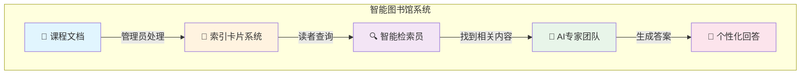
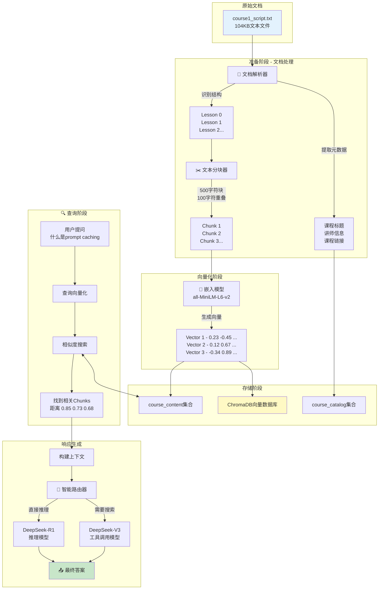
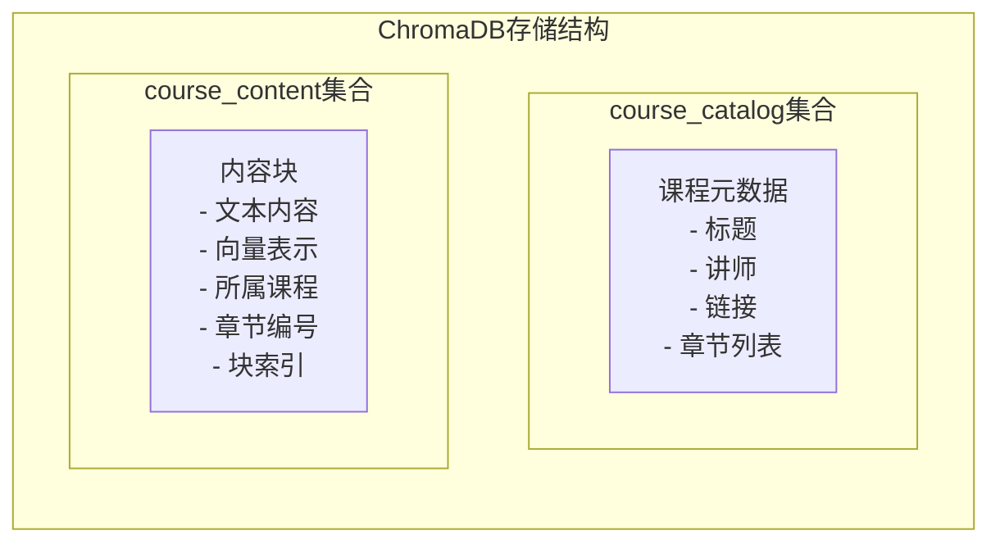
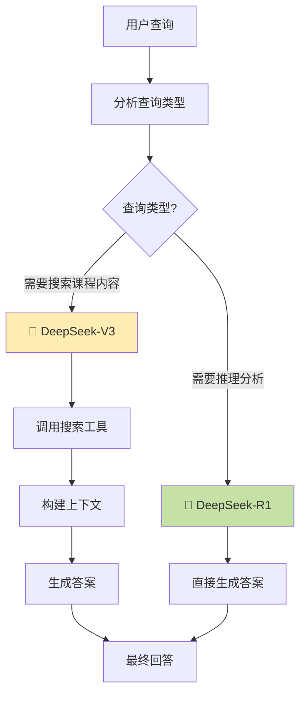
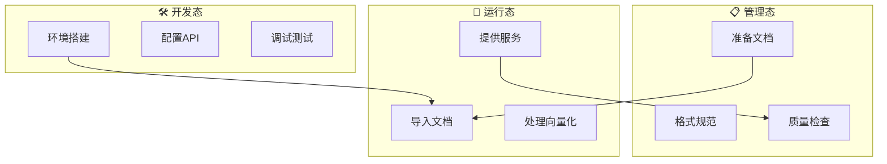
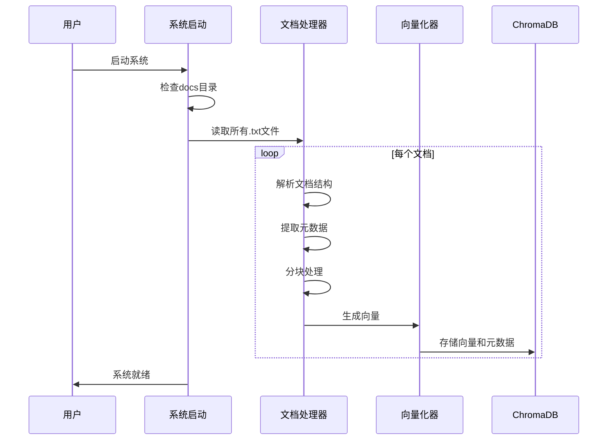
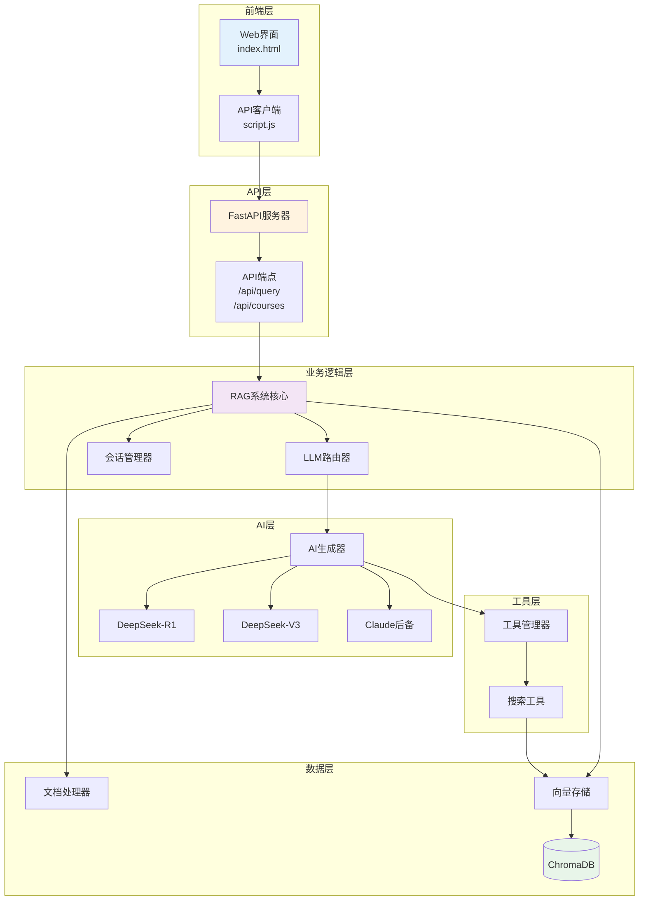
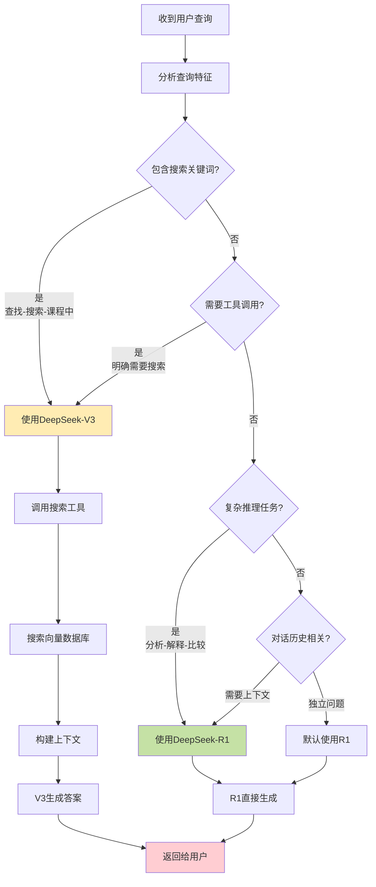
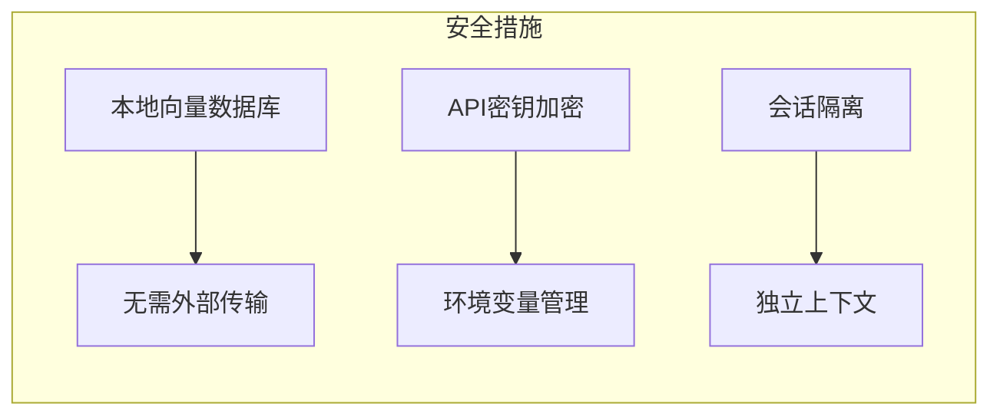

# 🎯 RAG系统完整指南：从课程文档到智能问答

> 本指南将用通俗易懂的方式，带你深入了解RAG系统如何将普通的课程文档转化为可智能查询的知识库，以及如何添加新的课程内容。

## 📖 目录

1. [系统概览：智能图书馆的比喻](#系统概览)
2. [Part 1: 课程文档的奇妙旅程](#part-1-课程文档的奇妙旅程)
3. [Part 2: 新增课程内容完整指南](#part-2-新增课程内容完整指南)
4. [Part 3: 技术架构详解](#part-3-技术架构详解)
5. [Part 4: 实战操作指南](#part-4-实战操作指南)
6. [常见问题解答](#常见问题解答)

---

## 🏛️ 系统概览

想象一下，我们的RAG系统就像一个**超级智能的图书馆**：



### 三大核心能力

1. **📥 知识摄入能力**：像消化系统一样，把文档"消化"成易于检索的知识块
2. **🔍 智能检索能力**：像记忆系统一样，快速找到相关的知识片段
3. **💡 智能生成能力**：像思考系统一样，基于找到的知识生成准确答案

---

## Part 1: 课程文档的奇妙旅程

### 🎬 场景设定

假设我们有一份课程文档 `course1_script.txt`，内容是关于"使用Anthropic构建计算机应用"的课程。让我们看看这份文档是如何一步步变成可查询的知识的。

### 📊 完整数据流程图



### 🔬 详细解析每个阶段

#### 1️⃣ **文档解析阶段**（就像阅读和理解）

```python
# 文档格式示例
"""
Course Title: Building Towards Computer Use with Anthropic
Course Link: https://www.deeplearning.ai/short-courses/...
Course Instructor: Colt Steele

Lesson 0: Introduction
Lesson Link: https://learn.deeplearning.ai/...
[课程内容...]
"""
```

**🍕 比喻**：就像把一个大披萨切成小块，每块都有完整的味道，但又便于食用。

系统会：
- 识别课程标题、讲师、链接等元数据
- 找出所有课程章节（Lesson 0, Lesson 1...）
- 保持内容的逻辑结构

#### 2️⃣ **文本分块阶段**（就像切蛋糕）

```python
# 分块策略
CHUNK_SIZE = 500        # 每块最多500个字符
CHUNK_OVERLAP = 100     # 块之间重叠100个字符

# 为什么要重叠？
# 原文: "提示缓存可以节省成本。提示缓存保留了处理结果..."
# Chunk 1: "...提示缓存可以节省成本。"
# Chunk 2: "节省成本。提示缓存保留了处理结果..."
#           ^^^^^^^^^ 重叠部分，确保上下文不丢失
```

**🎯 关键点**：
- **块大小**：太大难以精确匹配，太小缺少上下文
- **重叠策略**：确保句子不被截断，保持语义完整性
- **智能切分**：在句子边界切分，不在词中间断开

#### 3️⃣ **向量化阶段**（生成内容指纹）

```python
# 文本 → 向量的神奇转换
text = "什么是prompt caching？"
vector = [0.234, -0.456, 0.789, ...]  # 384维向量

# 相似的内容会有相似的向量
text1 = "提示缓存"     # → vector1 = [0.230, -0.450, 0.785, ...]
text2 = "prompt缓存"  # → vector2 = [0.232, -0.453, 0.787, ...]
text3 = "数据库优化"   # → vector3 = [0.890, 0.123, -0.456, ...]
#                         ^^^^ 完全不同的向量
```

**🔍 比喻**：就像每段文字都有独特的"指纹"，相似的内容指纹相似。

#### 4️⃣ **存储阶段**（建立索引系统）



#### 5️⃣ **查询处理阶段**（智能检索）

当用户问："什么是prompt caching？"

```python
# 1. 查询向量化
query_vector = embed("什么是prompt caching？")

# 2. 相似度搜索（余弦相似度）
results = vector_store.search(
    query_vector,
    n_results=5  # 找最相似的5个块
)

# 3. 结果示例
[
    {
        "text": "提示缓存保留了处理提示的部分结果...",
        "similarity": 0.92,  # 非常相似
        "metadata": {"course": "Building Towards...", "lesson": 5}
    },
    {
        "text": "Prompt caching是一个大的成本节省器...",
        "similarity": 0.85,  # 很相似
        "metadata": {...}
    }
]
```

#### 6️⃣ **智能生成阶段**（双模型协作）



---

## Part 2: 新增课程内容完整指南

### 🎯 三态管理模型



### 📝 步骤1：准备课程文档（管理态）

#### 文档格式规范

```text
Course Title: [课程完整名称]
Course Link: [课程URL地址]
Course Instructor: [讲师姓名]

Lesson 0: [章节标题]
Lesson Link: [章节URL]
[章节内容...]

Lesson 1: [章节标题]
Lesson Link: [章节URL]
[章节内容...]
```

#### 文件命名规范

```bash
docs/
├── course1_script.txt    # 课程1
├── course2_script.txt    # 课程2
├── ml_basics.txt         # 机器学习基础
└── deep_learning.txt     # 深度学习课程
```

### 🔧 步骤2：系统配置（开发态）

#### 环境变量配置 `.env`

```bash
# AI模型配置
LLM_PROVIDER=deepseek
LLM_API_KEY=your_deepseek_api_key
LLM_BASE_URL=https://llm.chutes.ai/v1

# 双模型配置
MODEL_REASON=deepseek-ai/DeepSeek-R1      # 推理模型
MODEL_TOOLCALL=deepseek-ai/DeepSeek-V3    # 工具调用模型

# 向量数据库配置
CHROMA_PATH=./chroma_db
EMBEDDING_MODEL=all-MiniLM-L6-v2

# 处理参数
CHUNK_SIZE=500
CHUNK_OVERLAP=100
MAX_RESULTS=5
```

### 📥 步骤3：导入课程内容（运行态）

#### 方式1：自动加载（推荐）

```python
# backend/app.py 启动时自动加载
@app.on_event("startup")
async def startup_event():
    docs_path = "../docs"
    if os.path.exists(docs_path):
        print("Loading initial documents...")
        courses, chunks = rag_system.add_course_folder(docs_path)
        print(f"Loaded {courses} courses with {chunks} chunks")
```

**流程图**：



#### 方式2：API上传

```python
# 通过API上传新课程
POST /api/upload
Content-Type: multipart/form-data

file: course5_script.txt
```

#### 方式3：手动添加

```python
# Python脚本添加
from backend.rag_system import RAGSystem
from backend.config import config

rag = RAGSystem(config)
course, chunks = rag.add_course_document("path/to/new_course.txt")
print(f"Added {course.title} with {chunks} chunks")
```

### ✅ 步骤4：验证和测试（管理态）

#### 验证清单

```python
# 1. 检查课程是否成功导入
GET /api/courses
# 返回：{"total_courses": 5, "course_titles": [...]}

# 2. 测试搜索功能
POST /api/query
{
    "query": "新课程的关键概念是什么？"
}

# 3. 检查向量数据库
courses = vector_store.get_all_courses_metadata()
for course in courses:
    print(f"课程: {course['title']}")
    print(f"章节数: {course['lesson_count']}")
```

---

## Part 3: 技术架构详解

### 🏗️ 系统整体架构



### 🔄 双模型智能路由决策树



---

## Part 4: 实战操作指南

### 🚀 快速开始：添加新课程

#### Step 1: 准备课程文档

创建文件 `docs/python_basics.txt`：

```text
Course Title: Python编程基础
Course Link: https://example.com/python-basics
Course Instructor: 张老师

Lesson 0: Python简介
Lesson Link: https://example.com/python-basics/intro
Python是一种高级编程语言，以其简洁和易读性著称。
它被广泛应用于Web开发、数据科学、人工智能等领域。

Lesson 1: 变量和数据类型
Lesson Link: https://example.com/python-basics/variables
在Python中，变量是存储数据的容器。
基本数据类型包括：整数(int)、浮点数(float)、字符串(str)、布尔值(bool)。
```

#### Step 2: 启动系统

```bash
# 确保在项目根目录
cd starting-ragchatbot-codebase

# 启动后端服务
./run.sh
# 或者
cd backend && uv run uvicorn app:app --reload --port 8000
```

#### Step 3: 验证导入

```bash
# 使用curl测试
curl http://localhost:8000/api/courses

# 应该看到新课程
{
    "total_courses": 5,
    "course_titles": [
        "Building Towards Computer Use with Anthropic",
        "...",
        "Python编程基础"  # 新添加的课程
    ]
}
```

#### Step 4: 测试查询

```bash
curl -X POST http://localhost:8000/api/query \
  -H "Content-Type: application/json" \
  -d '{"query": "Python的基本数据类型有哪些？"}'

# 响应
{
    "answer": "根据课程内容，Python的基本数据类型包括：整数(int)、浮点数(float)、字符串(str)、布尔值(bool)。",
    "sources": ["Python编程基础 - Lesson 1"],
    "session_id": "..."
}
```

### 🔧 高级配置

#### 优化分块策略

```python
# backend/config.py
class Config:
    # 针对不同内容类型的优化
    CHUNK_SIZE = 800      # 增大块大小（更多上下文）
    CHUNK_OVERLAP = 200   # 增大重叠（更好的连续性）
    
    # 针对中文内容的优化
    EMBEDDING_MODEL = "sentence-transformers/paraphrase-multilingual-MiniLM-L12-v2"
```

#### 批量导入优化

```python
# 批量导入脚本
import os
from pathlib import Path

def batch_import_courses(folder_path):
    """批量导入课程文档"""
    results = []
    
    for file_path in Path(folder_path).glob("*.txt"):
        try:
            course, chunks = rag_system.add_course_document(str(file_path))
            results.append({
                "file": file_path.name,
                "course": course.title,
                "chunks": len(chunks),
                "status": "success"
            })
        except Exception as e:
            results.append({
                "file": file_path.name,
                "error": str(e),
                "status": "failed"
            })
    
    return results
```

### 📊 性能监控

```python
# 监控导入性能
import time

def monitor_import_performance(file_path):
    start_time = time.time()
    
    # 文档处理
    parse_start = time.time()
    course, chunks = document_processor.process_course_document(file_path)
    parse_time = time.time() - parse_start
    
    # 向量化
    embed_start = time.time()
    vector_store.add_course_content(chunks)
    embed_time = time.time() - embed_start
    
    total_time = time.time() - start_time
    
    print(f"""
    性能报告：
    - 文档解析: {parse_time:.2f}秒
    - 向量化存储: {embed_time:.2f}秒
    - 总耗时: {total_time:.2f}秒
    - 块数量: {len(chunks)}
    - 平均每块: {total_time/len(chunks):.3f}秒
    """)
```

---

## 🤔 常见问题解答

### Q1: 为什么要将文档分块？

**答**：想象你在图书馆找一本书的某个知识点：
- 🚫 **不分块**：需要读完整本书才能找到答案
- ✅ **分块后**：直接定位到相关章节段落

分块让系统能够：
1. 精确匹配用户查询
2. 减少无关内容干扰
3. 提高检索速度
4. 优化token使用成本

### Q2: 如何选择合适的块大小？

```python
# 经验法则
if 内容类型 == "技术文档":
    CHUNK_SIZE = 500-800    # 需要更多上下文
elif 内容类型 == "问答对":
    CHUNK_SIZE = 200-300    # 独立性强
elif 内容类型 == "故事叙述":
    CHUNK_SIZE = 1000-1500  # 保持叙事完整性
```

### Q3: 向量相似度是如何工作的？

```python
# 简化示例
import numpy as np

def cosine_similarity(vec1, vec2):
    """计算余弦相似度"""
    dot_product = np.dot(vec1, vec2)
    norm_a = np.linalg.norm(vec1)
    norm_b = np.linalg.norm(vec2)
    return dot_product / (norm_a * norm_b)

# 示例
vec_query = [0.2, 0.5, 0.8]     # "机器学习"
vec_doc1 = [0.25, 0.48, 0.79]   # "深度学习和机器学习"
vec_doc2 = [0.9, 0.1, 0.2]      # "烹饪技巧"

sim1 = cosine_similarity(vec_query, vec_doc1)  # 0.99 (非常相似)
sim2 = cosine_similarity(vec_query, vec_doc2)  # 0.34 (不太相似)
```

### Q4: 双模型路由的优势是什么？

| 场景 | 单模型 | 双模型路由 |
|------|--------|------------|
| 简单查询 | ⚡ 快速但可能不准确 | ⚡ R1快速准确响应 |
| 需要搜索 | 🐢 模型不擅长工具调用 | ⚡ V3专门优化工具调用 |
| 复杂推理 | 😕 一个模型难以兼顾 | 💪 R1专注推理任务 |
| 成本控制 | 💰 所有任务同样成本 | 💲 按需选择，优化成本 |

### Q5: 如何处理多语言内容？

```python
# 配置多语言支持
class MultilingualConfig:
    # 使用多语言嵌入模型
    EMBEDDING_MODEL = "sentence-transformers/paraphrase-multilingual-MiniLM-L12-v2"
    
    # 针对中文的优化
    CHUNK_SIZE = 300        # 中文信息密度更高
    CHUNK_OVERLAP = 50      # 中文句子边界更清晰
```

### Q6: 数据安全性如何保证？



---

## 🎯 最佳实践总结

### ✅ DO - 推荐做法

1. **文档准备**
   - 保持格式规范统一
   - 添加完整的元数据
   - 合理组织章节结构

2. **系统配置**
   - 根据内容类型调整参数
   - 定期备份向量数据库
   - 监控系统性能指标

3. **内容管理**
   - 批量导入提高效率
   - 定期更新课程内容
   - 保持文档版本控制

### ❌ DON'T - 避免做法

1. **文档处理**
   - 避免过大的单个文档（>10MB）
   - 不要混合不同格式内容
   - 避免特殊字符和格式

2. **系统运维**
   - 不要频繁清空数据库
   - 避免在生产环境调试
   - 不要忽视错误日志

---

## 📚 深入学习资源

1. **RAG原理深度解析**
   - [Retrieval-Augmented Generation论文](https://arxiv.org/abs/2005.11401)
   - [向量数据库原理](https://www.pinecone.io/learn/vector-database/)

2. **ChromaDB文档**
   - [官方文档](https://docs.trychroma.com/)
   - [最佳实践](https://docs.trychroma.com/guides)

3. **嵌入模型选择**
   - [MTEB排行榜](https://huggingface.co/spaces/mteb/leaderboard)
   - [多语言模型对比](https://www.sbert.net/docs/pretrained_models.html)

---

## 🔗 相关文档

- [README.md](README.md) - 项目概述和快速开始
- [CLAUDE.md](CLAUDE.md) - 开发指南和规范
- [request_flow_analysis_v2.md](request_flow_analysis_v2.md) - 系统流程分析
- [LLM_MIGRATION_GUIDE.md](LLM_MIGRATION_GUIDE.md) - LLM迁移指南

---

**最后更新**: 2025年1月  
**版本**: 1.0  
**作者**: RAG System Team

> 💡 **提示**: 本指南会持续更新，欢迎提供反馈和建议！