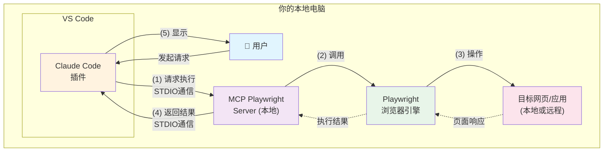

# MCP (Model Context Protocol) 配置指南

## 概述
MCP (Model Context Protocol) 是Claude的扩展协议，允许Claude与外部工具和服务进行交互。本指南主要介绍如何配置和使用MCP Playwright工具。

## MCP工作原理 - 端到端流程

### 为什么叫"服务器"却能离线工作？

虽然叫MCP "Server"，但它实际上是**本地进程服务器**，不是云端服务器。就像你电脑上的数据库服务器（如MySQL）一样，运行在本地机器上。

### 完整工作流程图



### 详细流程解释

#### 步骤1：用户在Claude Code中发起请求
```javascript
// 用户输入："帮我测试登录页面"
// Claude Code生成MCP调用
mcp__playwright__browser_navigate({ url: "http://localhost:3000/login" })
```

#### 步骤2：Claude Code与MCP Server通信
```bash
# Claude Code通过STDIO（标准输入输出）与MCP Server通信
# 不需要网络，只是进程间通信（IPC）
Claude Code -> [STDIO] -> MCP Playwright Server (node进程)
```

#### 步骤3：MCP Server执行实际操作
```javascript
// MCP Server内部运行的是本地Node.js代码
// 调用本地安装的Playwright库
const browser = await chromium.launch();
const page = await browser.newPage();
await page.goto('http://localhost:3000/login');
```

#### 步骤4：返回执行结果
```json
{
  "success": true,
  "screenshot": "base64_encoded_image_data",
  "pageTitle": "Login Page"
}
```

#### 步骤5：显示给用户
Claude Code将结果处理后展示给用户，包括截图、页面标题等信息。

### 为什么可以离线工作？

1. **MCP Server是本地进程**
   - 运行在你的电脑上，不是远程服务器
   - 类似于本地的Web服务器（如Apache、Nginx）

2. **通信方式是STDIO**
   - 使用标准输入输出，不是HTTP/HTTPS
   - 进程间直接通信，不经过网络

3. **Playwright是本地库**
   - 浏览器引擎（Chromium）安装在本地
   - 可以访问本地文件和localhost服务

### 通信协议细节

```yaml
通信方式: STDIO (Standard Input/Output)
协议格式: JSON-RPC
传输层: 进程管道（Pipe）

示例消息:
请求:
  {
    "jsonrpc": "2.0",
    "method": "playwright/navigate",
    "params": { "url": "http://localhost:3000" },
    "id": 1
  }

响应:
  {
    "jsonrpc": "2.0",
    "result": { "success": true },
    "id": 1
  }
```

### 与云端服务的对比

| 特性 | MCP本地服务器 | 传统云端服务器 |
|------|--------------|---------------|
| 位置 | 本地机器 | 远程数据中心 |
| 通信 | STDIO/IPC | HTTP/HTTPS |
| 延迟 | 微秒级 | 毫秒-秒级 |
| 依赖 | 无需网络 | 必须联网 |
| 数据 | 本地处理 | 需上传下载 |
| 隐私 | 数据不离开本机 | 数据传输到云端 |

## MCP Playwright 配置方式

### 方式一：通过 `mcp add` 命令（推荐用于Claude Code）

#### 安装步骤
```bash
# 在Claude Code终端中执行
mcp add playwright npx @playwright/mcp@latest
```

#### 配置文件位置
- **路径**: `C:\Users\{username}\.claude.json`
- **配置格式**:
```json
{
  "mcpServers": {
    "playwright": {
      "type": "stdio",
      "command": "npx",
      "args": ["@playwright/mcp@latest"],
      "env": {}
    }
  }
}
```

#### 特点
- 自动集成到Claude Code (VS Code插件)
- 包含完整的配置选项（type、env等）
- 配置与Claude Code的其他设置集成在一起
- 适合在VS Code环境中使用

### 方式二：通过 `npx` 手动配置（用于Claude Desktop）

#### 安装步骤
```bash
# 1. 首先安装MCP工具
npx @playwright/mcp@latest

# 2. 手动编辑配置文件
```

#### 配置文件位置
- **路径**: `C:\Users\{username}\AppData\Roaming\Claude\claude_desktop_config.json`
- **配置格式**:
```json
{
  "mcpServers": {
    "playwright": {
      "command": "npx",
      "args": ["@playwright/mcp@latest"]
    }
  }
}
```

#### 特点
- 用于Claude Desktop桌面应用
- 配置更简洁，只包含必需字段
- 需要手动编辑配置文件

## 两种方式的区别对比

| 特性 | mcp add 方式 | npx 手动配置方式 |
|------|-------------|----------------|
| **配置文件** | `.claude.json` | `claude_desktop_config.json` |
| **位置** | 用户根目录 | AppData/Roaming/Claude |
| **适用环境** | Claude Code (VS Code) | Claude Desktop |
| **配置复杂度** | 完整配置（含type、env） | 简化配置 |
| **安装方式** | 自动化 | 手动 |
| **推荐场景** | VS Code开发环境 | 桌面应用使用 |

## 使用建议

### 如果你主要在VS Code中使用Claude Code插件
1. 使用 `mcp add playwright` 命令安装
2. 配置会自动写入 `.claude.json`
3. 与VS Code环境深度集成

### 如果你使用Claude Desktop桌面应用
1. 使用 `npx @playwright/mcp@latest` 安装
2. 手动编辑 `claude_desktop_config.json`
3. 适合独立的桌面应用场景

## 验证配置

### 检查配置是否生效
```bash
# 在Claude Code中执行
/mcp playwright
```

### 查看已安装的MCP服务
1. 查看 `.claude.json` 中的 `mcpServers` 部分
2. 或查看 `claude_desktop_config.json` 中的配置

## 常见问题

### Q: 两个配置文件都存在时，哪个生效？
A: 在Claude Code (VS Code插件)中，优先使用 `.claude.json` 的配置。在Claude Desktop中，使用 `claude_desktop_config.json`。

### Q: 配置后工具不可用？
A: 
1. 检查配置文件格式是否正确
2. 确保 `npx` 命令可用
3. 重启Claude Code或Claude Desktop应用

### Q: 能否同时配置多个MCP工具？
A: 可以，在 `mcpServers` 对象中添加多个工具配置即可。

## MCP Playwright 使用示例 - 用户场景指南

### 如何让Claude Code使用Playwright MCP？

Claude Code会根据你的请求内容**自动识别**需要使用哪个MCP工具。当你的请求涉及以下内容时，会自动调用Playwright：

- 🌐 **网页相关**: "打开网页"、"访问网站"、"浏览器"
- 📸 **截图需求**: "截图"、"截屏"、"保存页面图片"
- 🖱️ **页面操作**: "点击"、"填写"、"输入"、"提交"
- 🔍 **页面分析**: "检查页面"、"获取内容"、"分析网页"

### 方式一：自然触发（推荐）

直接描述你想做的事情，Claude Code会自动识别并使用Playwright：

**示例对话**：
```
用户: 帮我打开百度首页并截图
Claude: 好的，我会使用浏览器工具帮你打开百度并截图...
[自动调用Playwright MCP]
```

### 方式二：明确指定

如果需要确保使用Playwright，可以在请求中明确提及：

**示例对话**：
```
用户: 使用playwright帮我测试登录页面
Claude: 我会使用Playwright工具来测试你的登录页面...
[调用Playwright MCP]
```

### 实际使用场景示例

#### 场景1：网页测试
```
用户: 打开我本地的网站localhost:3000，测试一下登录功能
Claude: 我会帮你打开本地网站并测试登录功能...
[Playwright自动启动浏览器并导航]

用户: 在用户名框输入admin，密码输入123456，然后登录
Claude: 正在填写登录表单...
[Playwright自动填写并提交]
```

#### 场景2：信息获取
```
用户: 去GitHub看看tensorflow项目有多少star
Claude: 我会打开GitHub查看tensorflow项目的信息...
[Playwright导航到GitHub并获取数据]
```

#### 场景3：批量操作
```
用户: 打开这5个产品页面，每个都截图保存
Claude: 我会依次打开这些页面并截图...
[Playwright批量处理]
```

#### 场景4：表单自动化
```
用户: 帮我自动填写这个注册表单
Claude: 我会查看表单结构并自动填写...
[Playwright识别并填写表单]
```

### 关键词触发列表

以下关键词会让Claude Code优先考虑使用Playwright：

| 类别 | 触发关键词 |
|------|----------|
| **浏览器操作** | 打开网页、访问网站、浏览器、Chrome、网址、URL |
| **页面交互** | 点击、单击、双击、右键、悬停、hover |
| **表单操作** | 填写、输入、填表、提交、上传文件 |
| **截图相关** | 截图、截屏、保存图片、页面快照 |
| **页面分析** | 检查页面、获取文本、提取链接、控制台日志 |
| **自动化测试** | 测试页面、自动化测试、UI测试、E2E测试 |

### 💡 使用技巧

1. **不需要特意提Playwright**
   - ✅ 好的表达: "帮我打开百度并搜索"
   - ❌ 不必要: "使用playwright的mcp__playwright__browser_navigate打开百度"

2. **描述越自然越好**
   - ✅ 自然: "填写用户名为test@email.com"
   - ❌ 技术化: "在input#username元素中输入值"

3. **可以连续对话**
   ```
   用户: 打开淘宝
   Claude: [打开淘宝首页]
   用户: 搜索iPhone
   Claude: [在搜索框输入并搜索]
   用户: 点击第一个商品
   Claude: [点击商品进入详情页]
   ```

4. **本地测试优先**
   - 测试localhost网站不需要网络
   - 速度更快，更安全可靠

## 离线使用说明

### 可以离线使用的功能
- **本地网页测试**: 访问本地HTML文件或localhost服务
- **浏览器自动化**: 执行点击、输入、截图等操作
- **JavaScript执行**: 在页面上运行自定义JS代码
- **本地文件处理**: 上传和处理本地文件

### 需要联网的场景
- **首次安装**: 下载 `@playwright/mcp` 包
- **浏览器二进制文件**: 首次使用可能需要下载Chromium/Firefox等
- **访问外部网站**: 测试互联网上的网页

### 离线使用准备步骤
```bash
# 1. 在有网络时完成安装
npm install -g @playwright/mcp

# 2. 下载浏览器二进制文件
npx playwright install chromium

# 3. 配置本地路径（不使用npx）
```

如果需要完全离线使用，建议修改配置：
```json
{
  "mcpServers": {
    "playwright": {
      "command": "node",
      "args": ["C:/Users/{username}/AppData/Roaming/npm/node_modules/@playwright/mcp/dist/index.js"]
    }
  }
}
```

## 注意事项

1. **权限要求**: MCP工具需要适当的权限才能访问本地资源
2. **安全考虑**: 仅安装可信的MCP工具
3. **版本更新**: 使用 `@latest` 标签确保使用最新版本
4. **环境隔离**: VS Code和Desktop的配置相互独立，互不影响
5. **离线限制**: 离线环境下无法访问外部网站，仅能测试本地应用

## 相关资源

- [MCP官方文档](https://modelcontextprotocol.io/)
- [Playwright MCP GitHub](https://github.com/modelcontextprotocol/playwright-mcp)
- [Claude Code文档](https://docs.anthropic.com/claude-code)

## 更新历史

- 2025-01-12: 初始版本，记录两种MCP Playwright配置方式