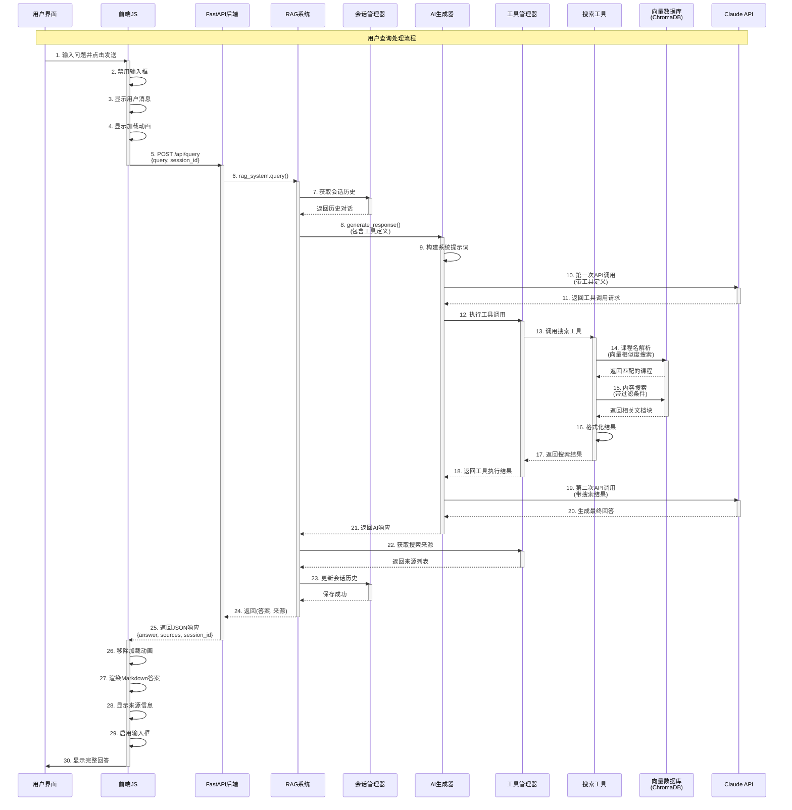
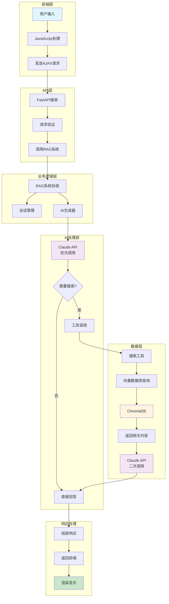
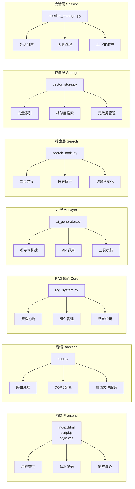
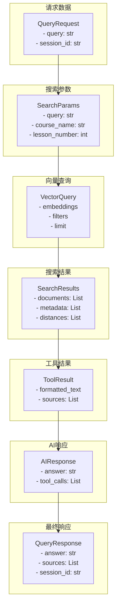
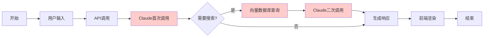

# 课程材料RAG系统 - 请求处理流程图

## 完整请求处理流程图

## 简化版数据流向图

## 关键组件职责图

## 数据结构流转

## 时序关键点说明

| 步骤 | 组件 | 操作 | 说明 |
|------|------|------|------|
| 1-4 | 前端 | 用户交互处理 | 输入验证、UI更新 |
| 5 | 网络 | HTTP请求 | POST到/api/query |
| 6-8 | RAG系统 | 请求预处理 | 会话管理、历史获取 |
| 9-11 | Claude API | 初次调用 | 判断是否需要搜索 |
| 12-17 | 搜索工具 | 数据库查询 | 向量搜索、过滤 |
| 18-20 | Claude API | 二次调用 | 基于搜索结果生成 |
| 21-24 | RAG系统 | 响应后处理 | 来源提取、会话更新 |
| 25-30 | 前端 | 响应渲染 | Markdown解析、UI更新 |

## 性能关键路径

**性能瓶颈点（红色标注）**：
1. Claude API调用（网络延迟）
2. 向量数据库查询（嵌入计算）
3. 二次Claude调用（额外延迟）