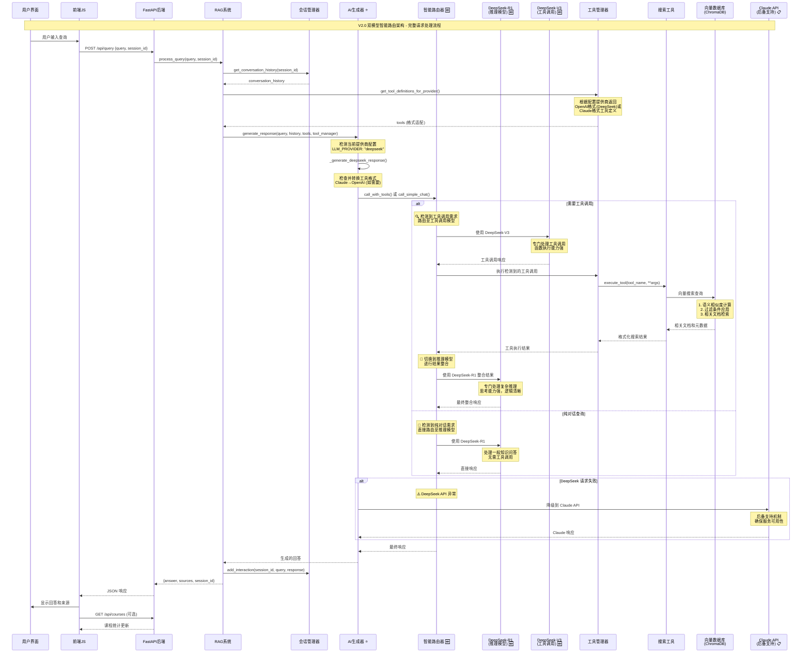
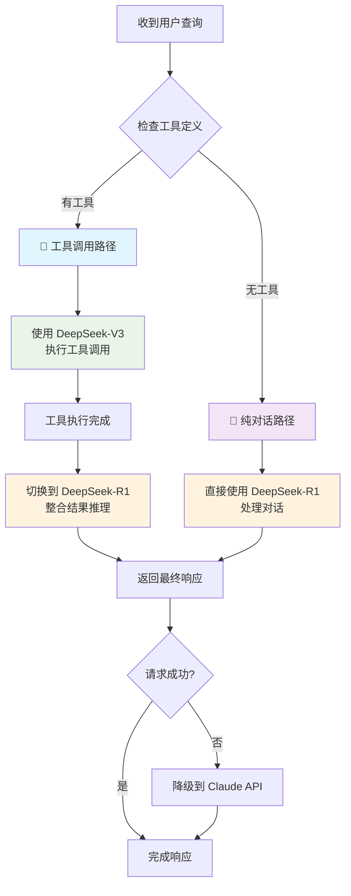
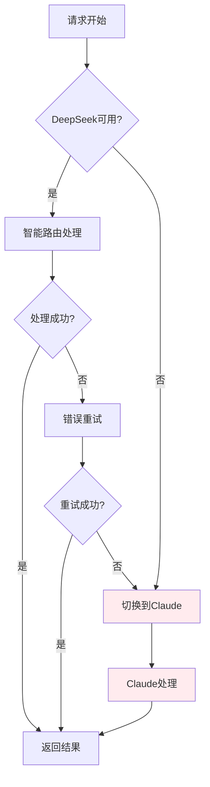

# 课程材料RAG系统 - 请求处理流程图 V2.0

## 双模型智能路由架构流程图



## V2.0 架构流程对比分析

### 关键改进点标注说明:

- **⭐ AI生成器**: 重构支持多提供商
- **🆕 智能路由器**: 全新组件，核心创新
- **🆕 双模型支持**: DeepSeek-R1 + DeepSeek-V3
- **📋 Claude后备**: 保留作为降级选项

## 智能路由决策树



## 双模型协同工作机制

### 工具调用场景流程:
1. **V3模型接收**: 用户查询 + 工具定义
2. **工具调用决策**: V3分析并决定调用搜索工具
3. **工具执行**: 搜索相关课程内容
4. **模型切换**: 自动切换到R1模型
5. **结果整合**: R1接收工具结果进行推理整合
6. **最终响应**: 生成完整的带来源回答

### 纯对话场景流程:
1. **直接路由**: 识别为一般知识问答
2. **R1处理**: 使用推理能力直接回答
3. **快速响应**: 无需工具调用的高效处理

## 性能优化特性

### 路由智能化:
- **任务识别**: 自动判断查询类型
- **模型选择**: 为任务选择最优模型
- **资源优化**: 避免不必要的模型调用

### 格式兼容性:
- **自动转换**: Claude格式→OpenAI格式
- **透明切换**: 用户无感知的API切换
- **统一接口**: 多提供商统一调用方式

## 错误处理和降级机制



## 配置驱动架构

系统通过环境变量配置实现动态切换:

```bash
# 双模型配置
LLM_PROVIDER=deepseek
MODEL_REASON=deepseek-ai/DeepSeek-R1      # 推理专用
MODEL_TOOLCALL=deepseek-ai/DeepSeek-V3    # 工具调用专用

# 后备配置  
ANTHROPIC_API_KEY=claude_key_here         # Claude后备支持
```

---

**V2.0 流程图总结**: 通过智能路由器实现双模型协同工作，根据任务类型自动选择最适合的AI模型，既保证了工具调用的准确性(V3)，又确保了推理过程的深度(R1)，同时提供Claude作为后备保障，实现了高可用、高性能的RAG系统架构。